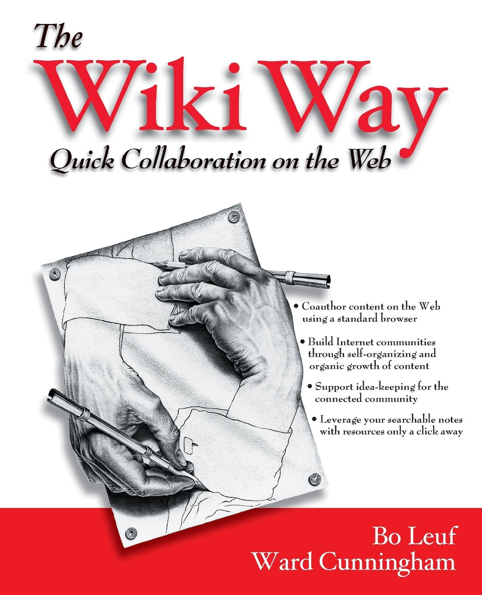

# Finding co-maintainers for your tools

---

Agenda:

- Presentation (15')
- Discussion (40')

---

It's happens all the time...

1. Get excited about something
2. Build some software for it!
3. People find it useful and rely on it

---

🎉

Success!

---

But time passes:

4. You get busy with life, work, or other projects
5. Things break or need improvements
6. There is no-one to take care of things!

---

Maybe you are no longer interested

or you are busy, and no-one has knowledge to fix things.

---

Useful software ends up abandoned, and it hurts the users that need it.

---

🤔

If only there was a way

---

Maybe we can treat our tools and software,

a bit more like a wiki?

---

## Collaborate with others!

---

## Why have co-maintainers?

---

### Collaboration 🤝

...like in the wikis!

---

### Bug reports

Users report bugs and help understand issues

---

### Bug fixes

Other devs can help fix open bugs and provide code review

---

### Operations

In platforms like Wikimedia Cloud Services, you can share operations work

like restarting, stopping, or deploying your software.

---

### Documenting things

will help others work with you,

and others can help you document things too!

---

### Answering questions!

When users, other devs, or sysadmins have questions,

co-maintainers can help answer questions and move things forward.

---

In general, your software will **live longer and be healthier**,

if you **work with others** and share ownership and responsibility.

---

## How do I find co-maintainers?

---

❌ There is no silver bullet.

⏳ It takes time for interested people to show up, and for them to be involved

but...

---

## There are things we can do! 👐

---

### Publish the code

- Pick a OSS license → https://opensource.org/licenses
- Publish the code → Gerrit, Gitlab, Github, etc.

---

### Be around, talk to others

- Be around in community channels:
  - Mailing lists like cloud@wikimedia.org
  - Chat venues like #wikimedia-cloud
  - phabricator.wikimedia.org
  - On wikis where your software is used
- Talk to people, share your work

---

### Get others involved

When a chance arises:

- Ask them to help you fix some docs
- Ask them to report a bug in your tracker of choice
- Ask them to fix a bug
- Share details about your projects

---

### Write documentation

- What does your project do?
- What does the code do?
- How can you run it or test it?
- How do you deploy it?

_This will make it easier for others to chime in,_

_and you will repeat yourself less._

---

### Create opportunities

- Schedule sessions in hackathons 😉
- Ask explicitly for help or feedback
- _What other ways can we create opportunities for collaboration?_

---

### Help others, get involved

If you help others when you have the opportunity,

you will build relationships and rapport,

and they will help you at some other time.

---

## Discussion

http://etherpad.wikimedia.org/p/wmhack21-finding-comaintainers

Prompts:

- What is your name?
- Have you built any tools?
  - Do you have co-maintainers
- Do you maintain any tools?
  - How did you become a co-maintainer?
- What can we do as a community to encourage a culture where people collaborate on software the same way they do on the wikis

Links:

- [Developing_community_norms_for_critical_bots_and_tools - `bd808`](https://wikitech.wikimedia.org/wiki/User:BryanDavis/Developing_community_norms_for_critical_bots_and_tools)
- [File:Stealing some of Wikimedia's Principles to Democratize Programming](https://commons.wikimedia.org/wiki/File:Stealing_some_of_Wikimedia%27s_Principles_to_Democratize_Programming.webm): talk about applying the wiki principles to programming

